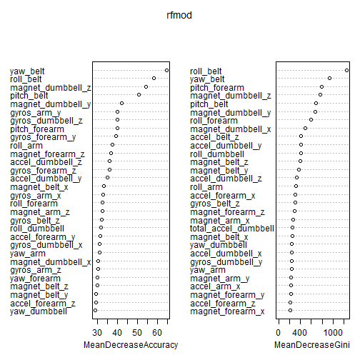

Weight Lifting Exercises Analysis
================


## Executive Summary

This analysis uses the [Weight Lifting Exercises Dataset](http://groupware.les.inf.puc-rio.br/har#weight_lifting_exercises) which consists of the measures recorded during a series of designated weight lifting exercises by six participants. These particpants executed the exercises according to the specification of 5 manners and our goal is to predict the manner, the "classe"" variable in the data set, in which they did the exercise for 20 different test cases.


### Load raw data

Load training and testing data files.

```r
training <- read.csv("C:/Users/0648/Desktop/R/data/pml-training.csv")
testing <- read.csv("C:/Users/0648/Desktop/R/data/pml-testing.csv")
```

Check the data loaded.There is a training set with 19622 cases, an outcome variable classe, and 159 potential predictors.The test set contains 20 cases with the same 159 potentail predictors.

```r
dim(training);head(training);str(training);summary(training)
dim(training);head(training);str(training);summary(training)
```


### Preprocess raw data

Remove aggregated window measures and some other irrelevant features, and re-assembly the training and testing sets with relevant predictors.

note: NAs columns in the testing data represent the aggregated window measures.

```r
nacount <- data.frame(apply(testing, 2, function(x) length(which(!is.na(x)))))
names(nacount) <- "nacount"
features <- cbind(feature=names(testing),nacount)
finalfeatures <- names(testing[,features$nacount==nrow(testing)])
finalfeatures <- as.vector(finalfeatures[1:length(finalfeatures)-1])
data.training <- cbind(training[,finalfeatures],classe=training$classe)
data.training <- data.training[,-c(1,3,4,5,6,7)]
data.testing <- (testing[,finalfeatures])
data.testing <- data.testing[,-c(1,3,4,5,6,7)]
```

Standarize numeric measures and create transformed training and testing data sets to be used as model training and predicting respectively.

```r
suppressWarnings(library(caret))
preProcValues <- preProcess(data.training[,-c(1,54)],method=c("center","scale"))
trainTransformed <- predict(preProcValues, data.training[,-c(1,54)])
trainTransformed <- cbind(user_name=data.training[,1],trainTransformed,classe=data.training[,54])
testTransformed <- predict(preProcValues,data.testing[,-c(1)])
testTransformed <- cbind(user_name=data.testing[,1],testTransformed)
```


### Fit Random Forest models

Fit a random forest model with 500 trees. 

```r
suppressWarnings(library(randomForest))
set.seed(2)
rfmod <- randomForest(classe~.,data=trainTransformed,ntree=500,importance=TRUE,
                      proximity=FALSE,varImpPlot=TRUE,varUsed=TRUE,do.trace=FALSE)
```

Produce the summary of the fitted model. The summary shows the OOB (Out-Of-Bag) error rates 0.28% for all cases and the 5 classes of the outcome variable in the training set. Since we use random forests to fit the model, there is no need for additional cross-validation or a separate test set to get an unbiased estimate of the test set error.

```r
print(rfmod)
```

```
## 
## Call:
##  randomForest(formula = classe ~ ., data = trainTransformed, ntree = 500,      importance = TRUE, proximity = FALSE, varImpPlot = TRUE,      varUsed = TRUE, do.trace = FALSE) 
##                Type of random forest: classification
##                      Number of trees: 500
## No. of variables tried at each split: 7
## 
##         OOB estimate of  error rate: 0.28%
## Confusion matrix:
##      A    B    C    D    E  class.error
## A 5578    1    0    0    1 0.0003584229
## B   11 3782    4    0    0 0.0039504872
## C    0   10 3411    1    0 0.0032144944
## D    0    0   19 3196    1 0.0062189055
## E    0    0    2    4 3601 0.0016634322
```

Produce variable importance plot which shows the order of importance (with respect to the classes) of predictors. Some predictors are in a slightly different order for the accuracy and GINI index plots. However, the important variables are consistently identified as yaw_belt, roll_belt, magnet_dumbbell_z, pitch_belt, and gyros_arm_y.

```r
varImpPlot(rfmod)
```

 

### Predict the classe variable for the test set.

Predict the classe varaible in the test set and show the results.

```r
pred <- predict(rfmod,testTransformed,type="response", norm.votes=TRUE, 
        predict.all=FALSE, proximity=FALSE, nodes=FALSE)
pred
```

```
##  1  2  3  4  5  6  7  8  9 10 11 12 13 14 15 16 17 18 19 20 
##  B  A  B  A  A  E  D  B  A  A  B  C  B  A  E  E  A  B  B  B 
## Levels: A B C D E
```

